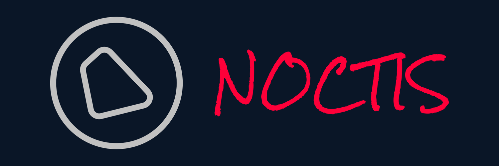

<div align="center">
  <a href="#">
    
  </a>

  <p align="center">
    <a href="https://github.com/othneildrew/Best-README-Template">演示✨</a>
    |
    <a href="https://github.com/othneildrew/Best-README-Template">文档📦</a>
  </p>
</div>

## 简介

Noctis Player 是一个基于 React、TypeScript 的音乐播放器。


### 技术栈

- [React](https://github.com/facebook/react/)
- [React Router][react router]
- [React Query][react query]]
- [TypeScript][typescript]
- [Material UI][material ui]
- [Emotion][emotion]
- [Axios](https://axios-http.com/docs/intro)

## 演示截图

截图

## 功能列表

- [ ] 登录/登出（目前仅支持手机密码登录）
- [ ] 主页
  - [ ] 热门推荐歌单
  - [ ] 推荐华语音乐
  - [ ] 推荐流行音乐
- [ ] 搜索页
  - [ ] 歌单分类
  - [ ] 精品歌单
  - [ ] 搜索建议
  - [ ] 搜索关键词（音乐、歌手...）
- [ ] 歌单详情页
  - [ ] 收藏/取消收藏歌单
  - [ ] 播放歌单
- [ ] 音乐播放功能
  - [ ] 播放列表
  - [ ] 单曲循环/随机播放
  - [ ] 切换歌曲
  - [ ] 拖拽进度条和音量条
  - [ ] 歌词滚动/点击歌词跳转
  - [ ] MV 页面(无 MV 播放栏不显示图标) 点击自动暂停音乐自动切换其他 MV
- [ ] 音乐库（需要登录）
  - [ ] 创建的歌单列表
  - [ ] 收藏的歌单列表

## 开始使用

```powershell
npm install

npm run start
```

## 贡献和支持 🤝

欢迎提供问题和功能需求, 如果大家有好的点子和优化建议, 也欢迎提 pr 参与我们的共建.

如果觉得项目还不错, 就点个 star 吧~

## 联系方式

Your Name

- [@your_twitter](https://twitter.com/your_username)
- email@example.com

## 参考 🖇️

项目灵感来自于以下项目

- [react-netease-music](https://github.com/uniquemo/react-netease-music)
- [NeteaseCloudMusicApi](https://binaryify.github.io/NeteaseCloudMusicApi)
